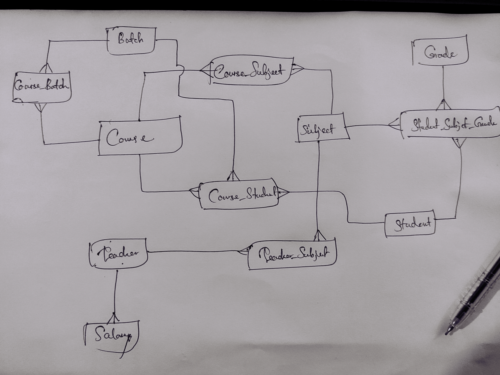

# CMS (Campus Management System)
Sample CRUD for campus management system using .NET and AngularJS

## Configurations
1 . First create connection using this <a href="https://github.com/Nilansha/CMS/tree/master/CMS/Database">Database Script</a> to your local database. Ex: (localdb)\MSSQLLocalDB.
 
 

## About Project

<code>/Courses</code>
      This module use AngularJS as a frontend library. This module includes three five seperate view templates.
      <ul>
        <li>Index</li>
        <li>Create</li>
        <li>Edit</li>
        <li>Details</li>
        <li>Delete</li>
      </ul>
      Inside AngularJs folder there are three main js files.
      <ul>
        <li>Controller.js</li>
        <li>Service.js</li>
        <li>Module.js</li>
      </ul>
      Other modules <code>/Subjects</code>, <code>/Teachers</code>, <code>/Students</code>, <code>/Grades</code> use .net Razor pages as frontend templates.
       
### Backend technologies used
        - ASP MVC 5
        - SQL Server using Entity Framework 6 and LocalDB
## Further Developments

You can extend your database as follows.

